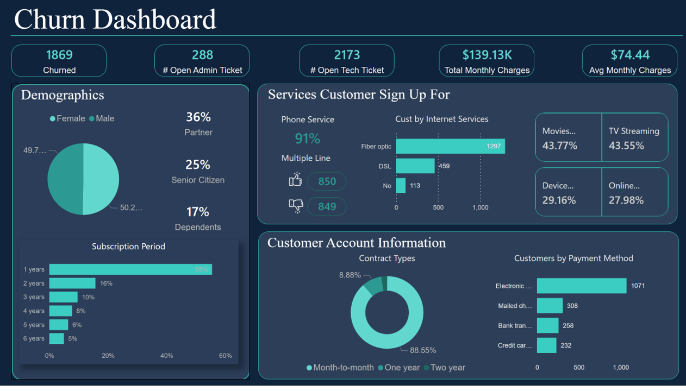

# Telecom Customer Churn Analysis

Our client MegaTel, a leading telecommunications company, is facing a growing issue with customer churn. Their current method with this problem is reactive which only reach out to customer after they've already canceled their service. Unfortunately this approach isn't working well since they couldn't prevent customer from leave them.

Furthermore, their attempts at analyzing customer data using Excel haven't been very helpful, and it's hard for management to grasp the insights they need from these analysis.

## Project Goals
Based on explanation we concluded the project goals 
1. Identify customers who churned
2. Develop a proactive customer retention strategy to identify and address customer needs before they churn
3. Implement data visualization tools to create clear and actionable insights for management.

## Project Deliverables
* Interactive dashboards that visually represent customer insight and retention strategies

## Data
This dataset is provided by PwC through Forage virtual intership. Please refers to their website to get access for the dataset

