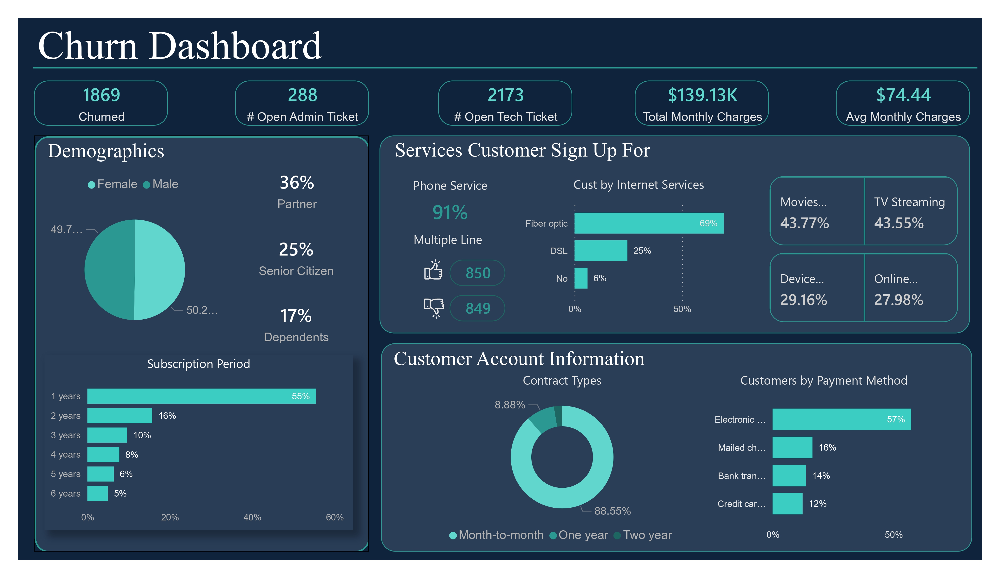
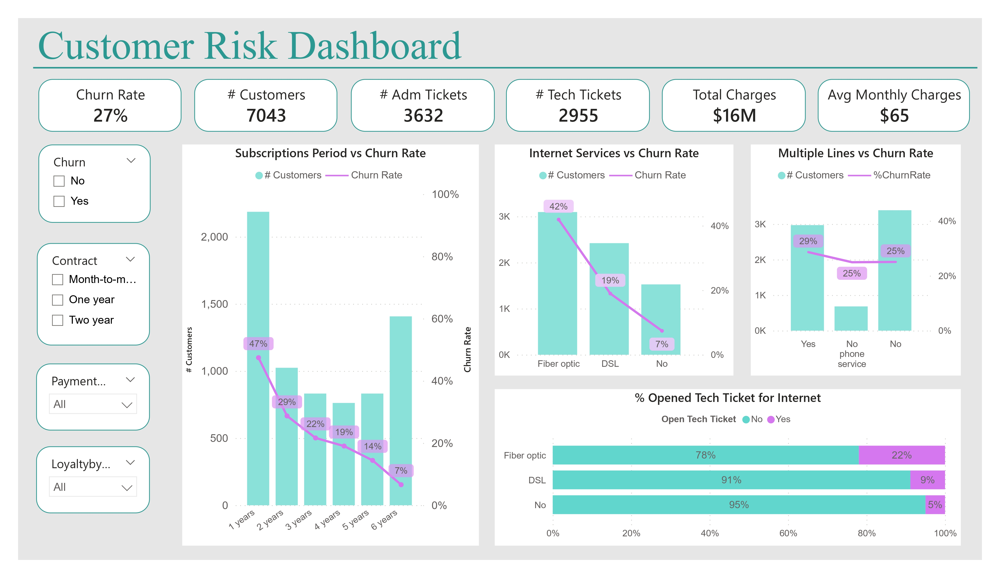
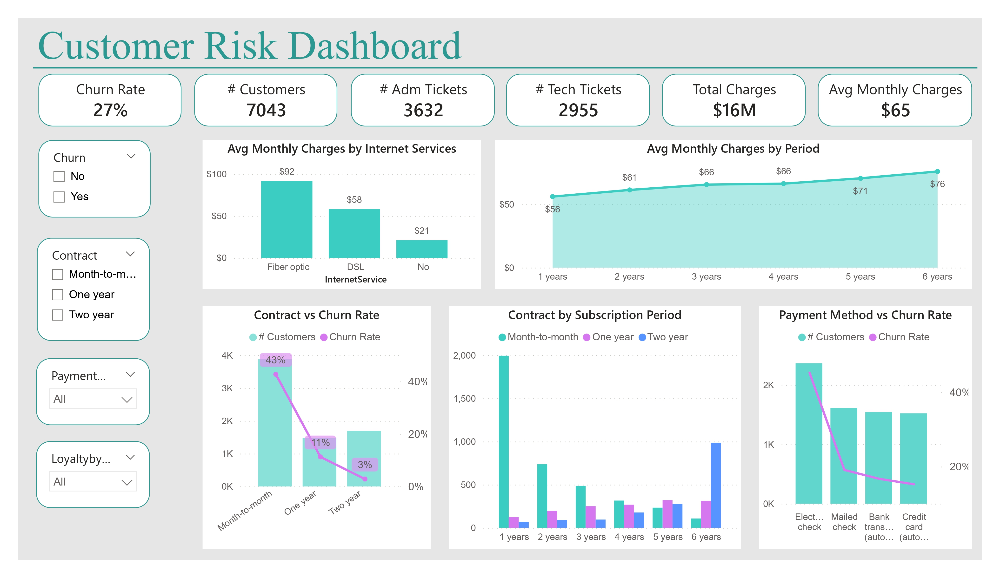

# Telecom Customer Churn Analysis

Our client MegaTel, a leading telecommunications company, is facing a growing issue with customer churn. Their current method with this problem is reactive which only reach out to customer after they've already canceled their service. Unfortunately this approach isn't working well since they couldn't prevent customer from leave them.

Furthermore, their attempts at analyzing customer data using Excel haven't been very helpful, and it's hard for management to grasp the insights they need from these analysis.

### Project Goals
Based on explanation we concluded the project goals 
1. Identify customers who churned
2. Develop a proactive customer retention strategy to identify and address customer needs before they churn
3. Implement data visualization tools to create clear and actionable insights for management.

### Project Deliverables
* Interactive dashboards that visually represent customer insight and retention strategies

### Data
This dataset is provided by PwC through Forage virtual intership. Please refers to their website to get access for the dataset

## Visualization
Through our visualizations, we have uncovered significant findings, we divide it into two parts customer churn analysis and customer risk analysis.
### Customer Churn Analysis
We initiated our analysis by filtering the dataset to identify customers who have churned, providing insights into their behavior and preferences.

Demographic Insight:
1. Majority of churned customers do not report having dependents or partners. **This observation hints at a potential discrepancy between the service offered and customer expectations, indicating a need for further investigation into factors influencing churn.**

2.  55% of churned customers were within their first year of subscription, with a majority churning within the first month. **This suggests potential dissatisfaction with the service provided or a failure to meet customer expectations.**

Usage Pattern Insight:
1. Among lost customers, 91% had subscribed to phone services, with no discernible differences observed for those who opted for multiple lines versus those who did not.

2. In terms of internet services, 69% of subscribers opted for Fiber Optic, while DSL accounted for 25% of subscribers, **suggesting potential dissatisfaction with the Fiber Optic services or pricing considerations.**

Customer account insight:
1. In terms of contract type, 89% of customers opt for month-to-month contracts. **This aligns with the observation that the majority of customers churn before completing one year of their subscription**

### Customer Risk Analysis
After we identified customers who already leave, we could use the data to identify customers at risk.

**Insight**
1. Customer within their first year especially the first 3 months exhibit a markedly higher churn rate compared to those in subsequent years. **This finding underscores the significance of addressing retention strategiies, particularly during the initial stages of customer acquisition**

2. Contrary to expectations, our analysis reveals that despite monthly contracts offering lower charges, they exibit the highest churn rates compared to other subscription options. This indicates that factors beyong pricing, such as flexibility or customer preferences heavily influence subscription decisions and subsequent churn rates. **This insight emphasize the need to explore non-price-related factores when devising retention strategies**

3. Despite not being driven solely by charges, it's significant to note that fiber optic services, which boast the highest average monthly fees, coincide with a notable volume of tecnical support tickets opened. **This correlation may indicate potential dissatisfaction with the services quality provided**.

4. Our examination of contract types distribution unveils a suprising trend: even customers subscribed for a 2 and 3-year period predominantly opt for monthly contracts. **This suggests potential dissatisfaction with the provided services, possibly leading to subscription cancellations**

## Retention Strategy
1. Enhanced Onboarding and Early Engagement
    * Provide proactive support and check-ins during the first few months to address any issues or concern promptly
    * Offer incentive or loyalty program to customers who remained subscribed beyond the first three months

2. Subscription Model Evaluation
    * Explore flexible pricing models or bundled offerings that cater to customer preferences and provide more perceived value.
    * Evaluate the appeal and feasibility of offering longer-term contracts (e.g., annual or multi-year) with potential discounts or added benefits.

3. Service Quality and Customers Support
    * Analyze the technical ticket support and identifying recurring issues or areas for service quality improvement
    * Implement proactive monitoring and resolution of service quality issues, particularly for fiber optic services.

4. Customer Feedback and Engagement
    * Implement regular customer satisfaction surveys and analyze feedback to identify areas for improvement, especially for non-pricing areas.
    